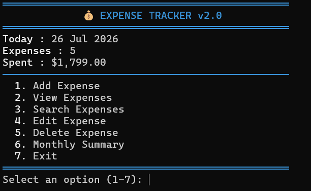
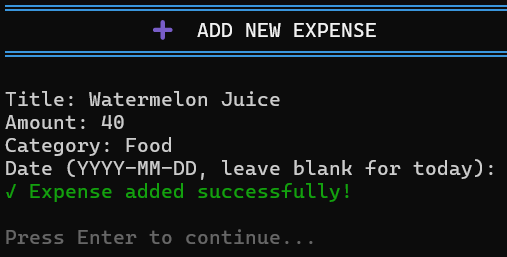
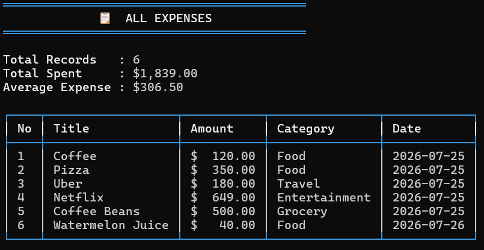
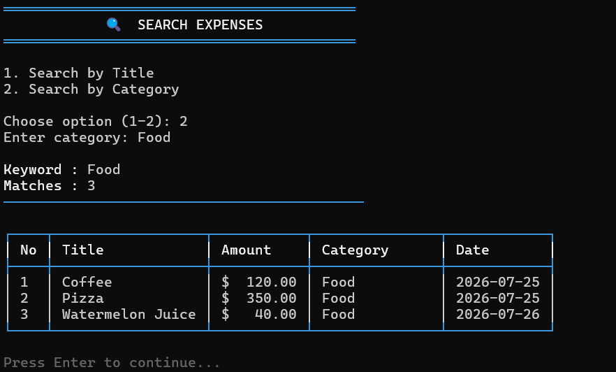
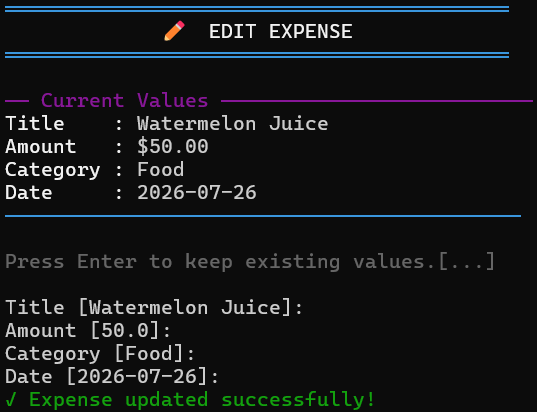
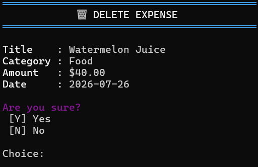
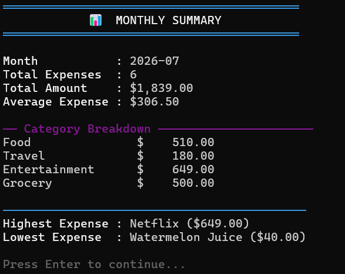
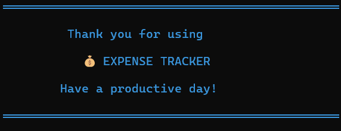

```markdown
# 💰 Expense Tracker Python (CLI v2.0)

A modular, test-driven Python command-line application built with clean architectural principles. Easily track daily expenses, view monthly analytics, and manage records through a rich interactive terminal interface.

---

## ✨ Features

- **📊 Dynamic Dashboard:** Real-time metrics including today's date, total records, and total amount spent.
- **➕ Expense Management:** Full CRUD operations (Add, View, Edit, Delete) with validation safety.
- **🔍 Search & Filter:** Quick search filtered by title keyword or category.
- **📈 Monthly Analytics:** Detailed summaries with category breakdowns, average spend, and highest/lowest records.
- **🛡️ Input Validation & Persistence:** Clean input sanitization backed by structured CSV file storage.
- **🎨 Rich Terminal UI:** Clean ASCII table layouts, styled banners, and consistent color themes.
- **🧪 Unit Tested:** Full test suite powered by `pytest` covering business logic, calculations, and updates.

---

## 🛠️ Tech Stack

- **Language:** Python 3.12+
- **Testing:** `pytest`
- **Formatting:** `black`
- **Storage:** CSV Engine (Abstracted for future DB migration)
- **VCS:** Git / GitHub

---

## 📁 Project Structure

```text
expense-tracker-python/
│
├── expense_tracker/
│   ├── cli.py          # Action routing and interactive loop
│   ├── manager.py      # Core business logic & analytics engine
│   ├── storage.py      # CSV storage handler
│   ├── models.py       # Expense data model
│   ├── validators.py   # Input validation rules
│   ├── display.py      # Terminal UI layout renderers
│   ├── ui.py           # Screen helpers, headers & banners
│   ├── theme.py        # Color and ANSI styling constants
│   └── constants.py    # Global configurations
│
├── tests/              # Unit test suite
│   ├── test_manager.py
│   ├── test_summary.py
│   ├── test_update.py
│   ├── test_display.py
│   └── test_validators.py
│
├── docs/
│   ├── screenshots/    # Application and diagram screenshots
│   ├── use_case_scenarios.md
│   └── use_case_diagram.md
│
├── main.py             # Entrypoint
├── requirements.txt
└── README.md

```
## 🖼️ Screenshots

### Main Menu



---

### Add Expense



---

### View Expenses



---

### Search Expense



---

### Edit Expense



---

### Delete Expense



---

### Monthly Summary



---

### Exit Screen


---

## 🚀 Running the Project

### 1. Clone the Repository

```bash
git clone [https://github.com/siddhardh7899583451/expense-tracker-python.git](https://github.com/siddhardh7899583451/expense-tracker-python.git)
cd expense-tracker-python

```

### 2. Create a Virtual Environment

```bash
python -m venv .venv

```

### 3. Activate the Virtual Environment

**Windows:**

```cmd
.venv\Scripts\activate

```

**macOS/Linux:**

```bash
source .venv/bin/activate

```

### 4. Install Dependencies

```bash
pip install -r requirements.txt

```

### 5. Run the Application

```bash
python main.py

```

### 6. Run the Test Suite & Formatter

```bash
# Run tests
python -m pytest

# Format code
python -m black .

```

---

## 🖼️ Screenshots

### Main Menu

---

### View Expenses

---

### Monthly Summary

---
## 📐 UML Documentation

The project includes complete software design documentation:

| Diagram | Status | Location |
|---|---|---|
| ✅ **Use Case Scenarios** | Completed | `docs/use_case_scenarios.md` |
| ✅ **Use Case Diagram** | Completed | `docs/use_case_diagram.md` |
| ✅ **Class Diagram** | Completed | `docs/class_diagram.md` |
| ✅ **Sequence Diagram** | Completed | `docs/sequence_diagram.md` |
| ✅ **Architecture Diagram** | Completed | `docs/architecture_diagram.md` |

All documentation files and Mermaid source files are available in the `docs/` directory.


### Use Case Diagram

---

## 🚀 Future Roadmap

* SQLite database integration
* Flask/FastAPI REST API
* React web dashboard
* User authentication
* Expense charts and visual analytics
* Docker containerization
* GitHub Actions CI/CD pipeline

---

## 📄 License

This project is licensed under the MIT License.

```