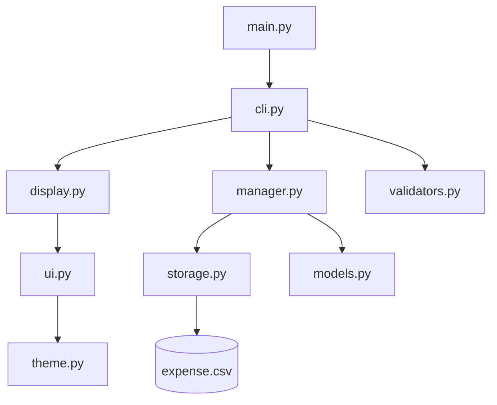

# Architecture Diagram

```mermaid
graph TD

A[main.py]

B[cli.py]

C[display.py]

D[ui.py]

E[theme.py]

F[manager.py]

G[validators.py]

H[storage.py]

I[models.py]

J[(expense.csv)]

A --> B

B --> C
B --> F
B --> G

C --> D

D --> E

F --> I

F --> H

H --> J
```