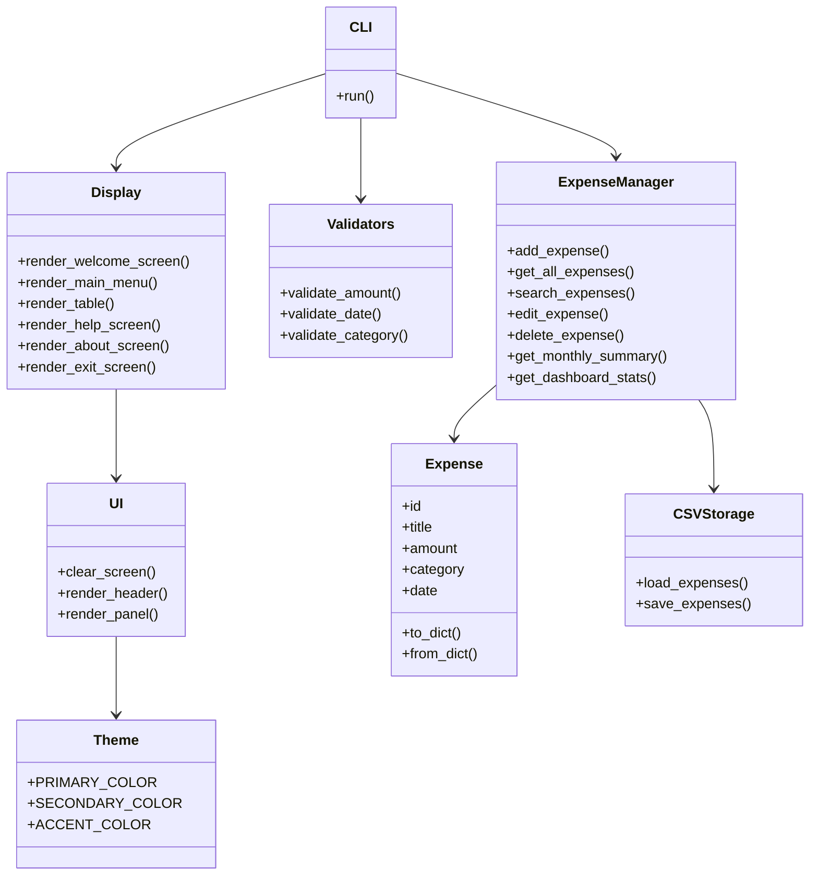

# Class Diagram

```mermaid
classDiagram
    class Theme {
        +PRIMARY_COLOR
        +SECONDARY_COLOR
        +ACCENT_COLOR
    }

    class UI {
        +clear_screen()
        +render_header()
        +render_panel()
    }

    class Expense {
        +id
        +title
        +amount
        +category
        +date
        +to_dict()
        +from_dict()
    }

    class CSVStorage {
        +load_expenses()
        +save_expenses()
    }

    class ExpenseManager {
        +add_expense()
        +get_all_expenses()
        +search_expenses()
        +edit_expense()
        +delete_expense()
        +get_monthly_summary()
        +get_dashboard_stats()
    }

    class Validators {
        +validate_amount()
        +validate_date()
        +validate_category()
    }

    class Display {
        +render_welcome_screen()
        +render_main_menu()
        +render_table()
        +render_help_screen()
        +render_about_screen()
        +render_exit_screen()
    }

    class CLI {
        +run()
    }

    UI --> Theme
    Display --> UI
    ExpenseManager --> Expense
    ExpenseManager --> CSVStorage
    CLI --> ExpenseManager
    CLI --> Display
    CLI --> Validators
```