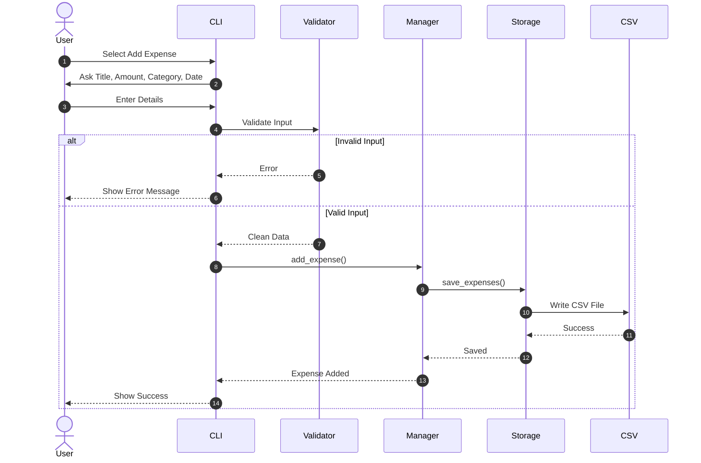

# Sequence Diagram – Add Expense

```mermaid
sequenceDiagram
    autonumber

    actor User
    participant CLI
    participant Validator
    participant Manager
    participant Storage
    participant CSV

    User->>CLI: Select Add Expense
    CLI->>User: Ask Title, Amount, Category, Date
    User->>CLI: Enter Details

    CLI->>Validator: Validate Input

    alt Invalid Input
        Validator-->>CLI: Error
        CLI-->>User: Show Error Message

    else Valid Input
        Validator-->>CLI: Clean Data

        CLI->>Manager: add_expense()

        Manager->>Storage: save_expenses()

        Storage->>CSV: Write CSV File

        CSV-->>Storage: Success

        Storage-->>Manager: Saved

        Manager-->>CLI: Expense Added

        CLI-->>User: Show Success
    end
```