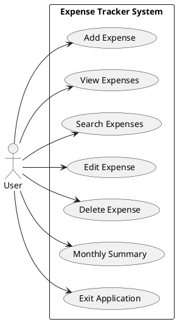

# Use Case Diagram

## Project

Expense Tracker Python (CLI v2.0)

---

## Primary Actor

**User**

The user interacts with the Expense Tracker application to manage personal expenses.

---

## System Use Cases

- Add Expense
- View Expenses
- Search Expenses
- Edit Expense
- Delete Expense
- Monthly Summary
- Exit Application

---

## UML Diagram (PlantUML)

---

## Diagram Description

The user is the only actor in the system.

The user can:

- Add new expenses
- View all expenses
- Search existing expenses
- Edit expense details
- Delete expenses
- View monthly summaries
- Exit the application

All functionality is initiated by the user through the command-line interface.